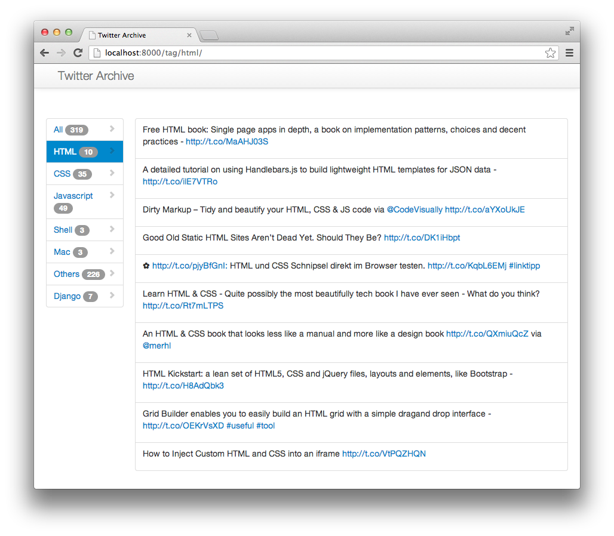

# Twitter Archive

Django app which imports your Twitter favorites and sorts them after tags.
Tags must be added by yourself with the admin.

## Background
I made this project to try working with the Twitter API, parsing and sorting Tweets.
Also i wanted to use my Twitter favorites like bookmarks. But without sorting, they aren't really useful to me.



## Install

0. Download the latest source
0. pip install -r REQUIREMENTS
0. manage.py syncdb migrate
0. Add your Twitter account name in the settings.py
   ```
   TWITTER_ACCOUNT = 'youraccount'
   ```

# Run it
0. manage.py getfavorites
0. Add your tags in the admin interface
0. manage.py updatetags
0. manage.py runserver

## Todo
- Better tag scanning
- Celery support
- Tagging by hand inside the frontend
- Use Bootstrap 3
- Add links to tweet (open tweet, delete, new tag, etc.)
